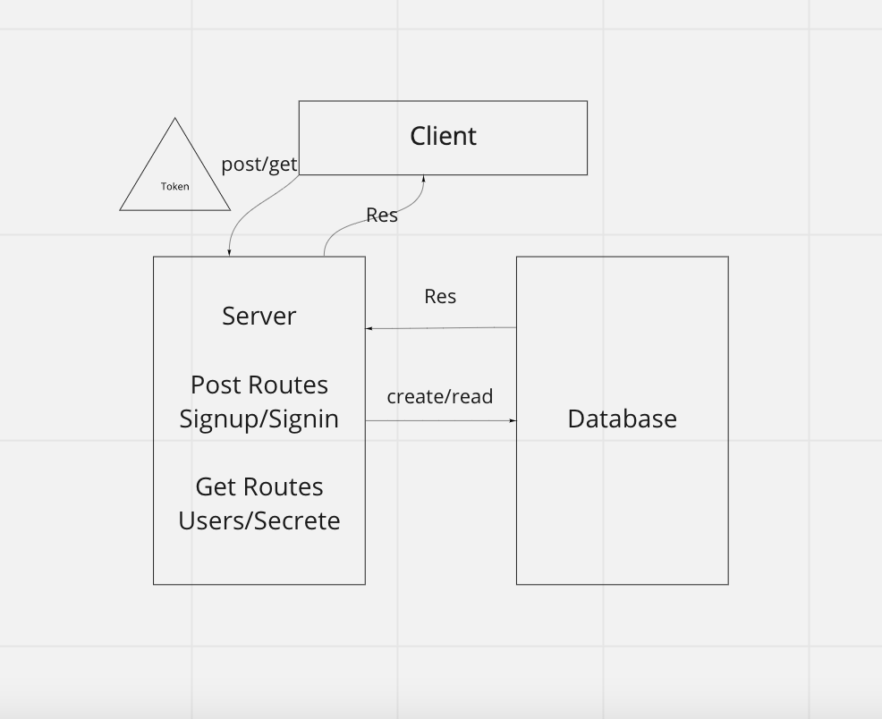

# bearer-auth

## Problem Domain
- As a user, I want to obtain a token after I signin, so that I can re-authenticate
- As a user, I want to use my token to access routes that require a valid user
- As the website owner, I want our token system to be as secure as possible so that our users can feel safe when logging in


## Installation
- In order to install, run `git clone git@github.com`

cd into express-server-deployment

run npm install

## Usage

To run the server, use ```npm start```

In order to test the server, use ```npm test```

## Routes
- POST /signup; with data from the body or from form, creates a user, immediately hashes password, then stores user in database
- POST /signin; with data from the headers, gets user from database, and compares the hashed password in the database to the password input, either validates or rejects if password matches or does not match
- GET /users; with data from bearer, with token, will be able to access all the users who have been saved to the database
- GET /secret; with data form the bearer, with token, will access the 'secret area'

## Features
- User:
  - username
  - password
  - token; made using a getter, which runs a function when token is called on

## UML 


